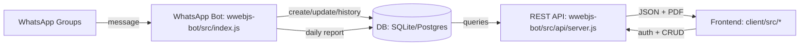

# SaaS Delivery (LivSight) — Repository Documentation

## Start here (junior dev)

If you’re new to the codebase, use this section to get productive fast.

### Quick run (local dev)

- **Backend API (recommended for dashboard work)**:

```bash
cd saasDelivery/wwebjs-bot
npm install
cp env.local.postgres.example .env   # or env.local.sqlite.example
npm run migrate
npm run api:dev
```

- **Web dashboard**:

```bash
cd saasDelivery/client
npm install
cp .env.example .env.local
npm run dev
```

### “Where do I change X?”

- **Sidebar / routes**: `client/src/components/layout/Sidebar.tsx` and `client/src/App.tsx`
- **Prestataire list** (UI label “Prestataire” = backend `groups`): `client/src/pages/operations/Groups.tsx`
- **Prestataire details**: `client/src/pages/operations/GroupDetail.tsx`
- **API routes**: `wwebjs-bot/src/api/routes/*`
- **DB queries**: `wwebjs-bot/src/db/*` (Postgres queries live in `src/db/postgres-queries.js`)

### Reference docs (don’t reinvent)

- **API reference**: `API.md`
- **Deployment**: `Production Deployment guide.md` and `PRODUCTION_DEPLOYMENT_CHECKLIST.md`

## Overview

This repository implements a multi-agency delivery management system with:

- A WhatsApp bot (using `whatsapp-web.js`) that listens to group messages, parses delivery/orders, and records updates to the database.
- A backend REST API (Express) exposing authenticated endpoints used by the frontend UI and by a **vendor mobile app** under `/api/v1/vendor` (separate from agency dashboard routes).
- A React + TypeScript frontend that provides dashboards, CRUD screens, reporting/export, and analytics.
- A dual database strategy:
  - SQLite for local development
  - PostgreSQL for production
- Multi-tenant (multi-agency) access control enforced by JWT payload (`role` + `agencyId`).

## Repo Structure

Top-level:

- `client/` — React frontend (Vite + shadcn/ui + Tailwind + React Query)
- `wwebjs-bot/` — WhatsApp bot + API server + DB layer (Node/Express + SQL adapters)
- Root docs:
  - `API.md` — HTTP API reference (includes `/api/v1/vendor` and push tokens)
  - `PRODUCTION_DEPLOYMENT_CHECKLIST.md`
  - `PRODUCTION_TROUBLESHOOTING.md`
  - `DOMAIN_AND_DEPLOYMENT_SETUP.md`
  - `CV_CONTEXT.md`

Key entrypoints:

- WhatsApp bot: `wwebjs-bot/src/index.js`
- API server: `wwebjs-bot/src/api/server.js`
- Frontend router/pages: `client/src/App.tsx` and `client/src/pages/*`

## System Architecture

### High-level flow

1. **WhatsApp bot receives messages** from configured WhatsApp groups.
2. Bot **parses delivery messages** (phone, items, amount, quartier, optional carrier).
3. Bot **creates deliveries** in the database and stores the WhatsApp message id for reply-based updates.
4. Bot **parses status update messages** (e.g. delivered, client absent, pickup, failures) and **updates the delivery** in the database.
5. The bot also **generates and sends daily reports** (optional) using the same delivery/stat computations.
6. Frontend users query the backend API to:
   - list deliveries with filters + pagination
   - view a delivery’s history
   - manage agencies, groups, tariffs
   - see stats and export PDFs for group reports
7. **Vendor mobile clients** (JWT `role: vendor`) call `/api/v1/vendor/*` to create deliveries scoped to their linked `groupId`/`agencyId`, manage stock items, register Expo push tokens, and read their profile — without using the WhatsApp bot.

### Data flow diagram (conceptual)



## Authentication & Authorization

### JWT in HTTP-only cookies

The backend uses JWT tokens stored in an HTTP-only cookie named `auth_token`.

- Login:
  - `POST /api/v1/auth/login` (and `/signin`)
  - sets `auth_token` cookie
- Session verification:
  - `GET /api/v1/auth/me` (cookie required)
- Logout:
  - `POST /api/v1/auth/logout` (cookie cleared)

Backend middleware: `wwebjs-bot/src/api/middleware/auth.js`

Key points:

- Middleware reads token from cookies first.
- When `AUTH_HEADER_FALLBACK=true` (or `1`), the same JWT may be sent as `Authorization: Bearer <token>` — required for typical **mobile / Expo** clients that do not use HTTP-only cookies.
- Role-based authorization happens via token payload:
  - `super_admin`
  - `agency` (agency admin)
  - `vendor` (linked to a parent agency and a `groupId`; used only for `/api/v1/vendor/*` routes)

### CORS (frontend -> API)

API CORS is configured in `wwebjs-bot/src/api/server.js`:

- In development: allows all origins.
- In production: uses `ALLOWED_ORIGINS` (comma-separated) and matches normalized origins.
- Cookies/credentials are allowed (`credentials: true`).

## Database & Data Model

### Core tables (from migrations)

Base migrations define these tables:

- `agencies`
  - owner accounts for login (agencies, super admins, and **vendors** — vendors use `role = 'vendor'` with `parent_agency_id` and `group_id` set)
  - fields include `name`, `email`, `password_hash`, `role`, `is_active`, and `agency_code` (added later)
- `groups`
  - WhatsApp groups linked to an agency
  - fields include `agency_id`, `whatsapp_group_id` (unique), `name`, `is_active`
- `deliveries`
  - delivery records
  - fields include `phone`, `items`, `amount_due`, `amount_paid`, `status`, `quartier`, `notes`, `carrier`, `group_id`, `agency_id`, `whatsapp_message_id`, `delivery_fee`, and optional **`created_by_user_id`** (vendor `agencies.id` when the row was created via `POST /api/v1/vendor/deliveries`; used for Expo push targeting)
- `stock_items`
  - vendor inventory rows scoped by `group_id` (name, subtitle, quantity)
- `vendor_push_tokens`
  - Expo push tokens per vendor user (`vendor_user_id` → `agencies.id`), unique `expo_push_token`, `platform` (`ios` / `android`)
- `delivery_history`
  - audit trail of changes to deliveries
  - fields include `delivery_id`, `action`, `details`, `actor`, and optional `agency_id`
- `tariffs`
  - pricing per `quartier` per agency
  - fields include `agency_id`, `quartier`, `tarif_amount`

Migration files:

- `wwebjs-bot/db/migrations/20250101000000_initial_schema.sql`
- `wwebjs-bot/db/migrations/20250101010000_create_tariffs_table.sql`
- and subsequent migrations updating schema (e.g. `delivery_fee`, `agency_code`, etc.)

### Relationships

- `groups.agency_id` references `agencies.id`
- `deliveries.group_id` references `groups.id` (nullable on delete)
- `deliveries.agency_id` references `agencies.id`
- `delivery_history.delivery_id` references `deliveries.id` (cascade delete)
- `tariffs.agency_id` references `agencies.id` (cascade delete)

### Delivery status vocabulary

Backend status values (TypeScript frontend types mirror these):

- `pending`, `delivered`, `failed`, `pickup`, `expedition`
- `cancelled`, `postponed`
- `client_absent`, `unreachable`, `no_answer`
- `present_ne_decroche_zone1`, `present_ne_decroche_zone2`

Frontend status values (French):

- `en_cours`, `livré`, `échec`, `pickup`, `expedition`, `annulé`, `renvoyé`
- `client_absent`, `injoignable`, `ne_decroche_pas`
- `present_ne_decroche_zone1`, `present_ne_decroche_zone2`

Status mapping is implemented in:

- `client/src/lib/data-transform.ts`

Notable mapping behavior:

- Backend `failed`/`cancelled` map to frontend `annulé`
- Frontend remaining amount (`restant`) is computed:
  - `0` for delivered/pickup/cancelled/postponed/unreachable/no_answer and present_ne_decroche_* statuses
  - otherwise `max(0, montant_total - montant_encaisse)` (backend amount_due - amount_paid)

## WhatsApp Bot (wwebjs-bot/src/index.js)

### Runtime & session handling

Bot entrypoint: `wwebjs-bot/src/index.js`

The bot:

- Creates a WhatsApp Web.js client with LocalAuth.
- Uses `CLIENT_ID` to isolate sessions per environment.
- Displays QR code in terminal and saves `qr-code.png` when authentication is needed.
- Registers listeners for:
  - `message_create` (forwarded to the existing `message` handler)
  - `message`
  - `authenticated` and `disconnected` (reconnect logic)

### Which WhatsApp messages are processed

In the `message` handler:

- The bot **processes only group messages** (`chat.isGroup === true`).
- If `GROUP_ID` is set in config, the bot **filters to a single target group**.
- If the group is **not present in the database**, the bot currently **ignores it** (it does not auto-register groups from messages).

Group lookup is done via:

- `getGroup()` in `wwebjs-bot/src/utils/group-manager.js`
- and called from the bot’s message handler.

Result:

- To start processing a new WhatsApp group, create it in the dashboard (`Groups` page) so `groups.whatsapp_group_id` exists and `is_active` matches expected state.

### Parsing a new delivery message

Delivery parsing is implemented in:

- `wwebjs-bot/src/parser.js`

The bot tries multiple structured formats:

- Alternative format (quartier first, products in middle, amount + phone at end)
- Compact structured format (phone/items/amount/quartier lines)
- Fallback flexible parsing (extracts phone, amount, quartier, optional carrier and customer name)

If parsing succeeds, the bot:

1. stores `whatsapp_message_id` (`msg.id._serialized`)
2. calls `createDelivery()` with:
   - `phone`, `items`, `amount_due`
   - `quartier`, `carrier` (optional)
   - `agency_id` and `group_id` from group record
   - `notes` containing original message snippet

### Parsing and applying status updates (including reply-based updates)

Status parsing is implemented in:

- `wwebjs-bot/src/statusParser.js`

Status update handling in the bot:

- The bot decides whether a message is a status update using:
  - `isStatusUpdate(messageText)` OR
  - a reply detected via `msg.hasQuotedMsg`, then it tries to find a delivery linked to the quoted message id.

Reply-based updates:

- If the message quotes a previous WhatsApp message:
  - Bot extracts quoted message ids (`_serialized`, `remote`, `id`)
  - Bot attempts to find the corresponding delivery via `findDeliveryByMessageId()`
- This allows updating a delivery even without including the phone number in the status message.

Update rules:

- Supported update types include:
  - `delivered` (paid logic; may auto-mark delivered when fully paid)
  - `client_absent` (tariff applied but `amount_paid` forced to 0)
  - `failed` / `postponed` (tariff canceled; `delivery_fee = 0` and `amount_paid = 0` if needed)
  - `payment` (`Collecté X` or `Livré` with amount); may auto-transition to delivered if fully paid
  - `pickup` (tariff uses fixed logic)
  - `pending` / `modify` / `number_change` (update delivery fields)

Tariff logic during status updates is applied through:

- `getTariffByAgencyAndQuartier(agencyId, quartier)` when needed

### Daily report scheduler

Daily report generation is implemented in:

- `wwebjs-bot/src/daily-report.js`
- `wwebjs-bot/src/send-report.js`

The bot schedules daily reports in `setupDailyReportScheduler()` inside `wwebjs-bot/src/index.js`.

Config toggles:

- `REPORT_ENABLED`
- `REPORT_TIME` (HH:MM)
- `REPORT_SEND_TO_GROUP` and `GROUP_ID`
- `REPORT_RECIPIENT` (direct phone number)

The daily report computation uses delivery stats from DB queries (delivered/pending/pickup/failed counts and amounts).

## REST API (wwebjs-bot/src/api/server.js and routes)

### Base paths

The API serves under:

- `/api/v1/*`

Entry file:

- `wwebjs-bot/src/api/server.js`

Routes are registered from:

- `wwebjs-bot/src/api/routes/auth.js`
- `wwebjs-bot/src/api/routes/agencies.js`
- `wwebjs-bot/src/api/routes/groups.js`
- `wwebjs-bot/src/api/routes/tariffs.js`
- `wwebjs-bot/src/api/routes/deliveries.js`
- `wwebjs-bot/src/api/routes/expeditions.js`
- `wwebjs-bot/src/api/routes/stats.js`
- `wwebjs-bot/src/api/routes/search.js`
- `wwebjs-bot/src/api/routes/reports.js`
- `wwebjs-bot/src/api/routes/reminder-contacts.js` / `reminders.js` (if enabled in your deployment)
- `wwebjs-bot/src/api/routes/vendors.js` — **agency admin** CRUD for vendor *accounts* (`/api/v1/vendors`)
- `wwebjs-bot/src/api/routes/vendor.js` — **vendor JWT** mobile namespace (`/api/v1/vendor`)

### Unauthenticated endpoints

- `GET /api/v1/health`
- `POST /api/v1/auth/login`
- `POST /api/v1/auth/signin`
- `POST /api/v1/auth/signup`

### Cookie-authenticated endpoints (and vendor Bearer)

Most dashboard routes require `authenticateToken` with the HTTP-only cookie `auth_token`.

Vendor mobile routes (`/api/v1/vendor/*`) use the same `authenticateToken` middleware but typically supply the JWT via **`Authorization: Bearer <token>`** when `AUTH_HEADER_FALLBACK` is enabled.

The backend also exposes a schema/migration status endpoint:

- `GET /api/v1/schema/status`
  - checks pending migrations by reading `schema_migrations` and migration files under `wwebjs-bot/db/migrations/`.

### Authentication API

- `POST /api/v1/auth/login`
  - body: `{ email, password }`
  - sets `auth_token` cookie
  - returns `{ success: true, data: { user: { id, name, email, role, agencyId } } }`
- `POST /api/v1/auth/logout`
  - cookie required
  - clears cookie and returns success
- `GET /api/v1/auth/me`
  - cookie required
  - returns the authenticated user record

### Agencies API (super admin management)

File: `wwebjs-bot/src/api/routes/agencies.js`

Common patterns:

- Agency admins typically use group/tariff/delivery endpoints filtered by their `agencyId`.
- Super admins manage agencies.

Endpoints (as implemented):

- `GET /api/v1/agencies/me`
  - not for `super_admin` (403 if role is `super_admin`)
- `GET /api/v1/agencies`
- `GET /api/v1/agencies/:id`
- `PUT /api/v1/agencies/:id`
  - agency admins can only update their own agency
  - super admins can update full agency fields (including `password`, `role`, `agency_code`, `is_active`)
- `DELETE /api/v1/agencies/:id`

### Groups API

File: `wwebjs-bot/src/api/routes/groups.js`

Endpoints:

- `GET /api/v1/groups`
  - super_admin: returns all groups (including inactive)
  - agency: returns only groups belonging to the user’s agency id
- `GET /api/v1/groups/:id`
  - enforces agency ownership unless super admin
- `POST /api/v1/groups`
  - validates `whatsapp_group_id` format: `numbers@g.us`
  - agency admins can only create under their own agency
- `PUT /api/v1/groups/:id`
  - toggles `is_active` and/or updates `name`
  - enforces agency ownership unless super admin
- `DELETE /api/v1/groups/:id`
  - soft delete by default (`is_active = false`)
  - hard delete when `?permanent=true`

### Tariffs API (pricing per quartier)

File: `wwebjs-bot/src/api/routes/tariffs.js`

Endpoints:

- `GET /api/v1/tariffs`
  - agency admins: only their tariffs
  - super_admin: all tariffs
- `GET /api/v1/tariffs/:id`
  - enforces ownership for agency admins
- `POST /api/v1/tariffs`
  - body: `{ agency_id?, quartier, tarif_amount }`
  - agency admins auto-assign target agency from token
- `PUT /api/v1/tariffs/:id`
  - updates `quartier` and/or `tarif_amount`
- `DELETE /api/v1/tariffs/:id`
  - deletes tariff row
- `POST /api/v1/tariffs/import`
  - multipart upload with field name `file`
  - supports CSV or Excel
  - for each row:
    - reads `quartier` and `tarif_amount` from normalized columns
    - upserts based on `(agency_id, quartier)`

### Deliveries API

File: `wwebjs-bot/src/api/routes/deliveries.js`

All deliveries routes are cookie-authenticated (`router.use(authenticateToken)`).

#### List deliveries

- `GET /api/v1/deliveries`
  - query params:
    - pagination: `page` (default 1), `limit` (default 50)
    - filters: `status`, `date`, `phone`, `startDate`, `endDate`
    - sorting: `sortBy` (default `created_at`), `sortOrder` (`ASC`/`DESC`)
    - scoping:
      - `group_id` optional (backend expects numeric)
      - `agency_id` optional only for super admins; agencies are otherwise auto-filtered by token

Response:

- `{ success: true, data: FrontendDeliveryBackendShape[], pagination: { ... } }`

#### Bulk create deliveries

- `POST /api/v1/deliveries/bulk`
  - body:
    - `{ deliveries: Array<{ phone, items, amount_due, amount_paid?, status?, quartier?, notes?, carrier? }> }`
  - max 100 items
  - returns per-item success/failure details

#### Create delivery

- `POST /api/v1/deliveries`
  - required:
    - `phone`, `items`, `amount_due`
  - optional:
    - `customer_name`, `amount_paid`, `status`, `quartier`, `notes`, `carrier`, `delivery_fee`, `group_id`
  - tariff behavior:
    - if `delivery_fee` is not provided, backend applies automatic tariff logic based on `status` and/or `quartier`
    - if `delivery_fee` is provided manually, backend adjusts `amount_paid` depending on status semantics

#### Get delivery by id

- `GET /api/v1/deliveries/:id`

#### Update delivery

- `PUT /api/v1/deliveries/:id`
  - accepts partial updates; the backend applies tariff adjustments for certain status transitions
  - also saves changes to `delivery_history` for each modified field
  - **vendor role** receives `403` (vendors must not change delivery status from the app; agencies do that from the dashboard)
  - when **`status` changes** and the delivery has **`created_by_user_id`** (vendor-created row), the server sends a **non-blocking Expo push** to that vendor’s registered token(s) (implementation: `wwebjs-bot/src/lib/expoPush.js`; optional env `EXPO_ACCESS_TOKEN`)

#### Delete delivery

- `DELETE /api/v1/deliveries/:id`
  - super_admin can delete any delivery
  - agency can delete only deliveries where `deliveries.agency_id` matches token agency
  - **vendor role** receives `403`

#### Delivery history

- `GET /api/v1/deliveries/:id/history`
  - returns history entries

### Vendor API (mobile app)

File: `wwebjs-bot/src/api/routes/vendor.js`  
Mounted at: **`/api/v1/vendor`**

This namespace is **additive**: it does not replace `/api/v1/deliveries` or `/api/v1/vendors`. It exists so production dashboard and bot flows keep using existing routes while the mobile app uses a dedicated surface.

- **Auth**: `authenticateToken` + `requireVendor` (JWT must have `role: vendor` with `groupId` / `agencyId` in the payload).
- **Scoping**: list/create operations are restricted server-side to the vendor’s **`group_id`** and **`agency_id`** from the token (same pattern as other vendor features).

Endpoints (summary):

| Method | Path | Purpose |
|--------|------|--------|
| GET | `/api/v1/vendor/me` | Current vendor profile (`agencies` row) |
| GET | `/api/v1/vendor/deliveries` | List deliveries for vendor’s group/agency (same query params style as `GET /deliveries`) |
| POST | `/api/v1/vendor/deliveries` | Create delivery; sets **`created_by_user_id`** to the vendor for push notifications |
| GET | `/api/v1/vendor/stock-items` | List stock items for vendor’s `group_id` |
| POST | `/api/v1/vendor/stock-items` | Create stock item |
| PATCH | `/api/v1/vendor/stock-items/:id` | Update quantity via **`delta`** or absolute **`quantity`** |
| DELETE | `/api/v1/vendor/stock-items/:id` | Remove stock item |
| POST | `/api/v1/vendor/push-tokens` | Register/update Expo push token `{ expoPushToken, platform: "ios"\|"android" }` |
| DELETE | `/api/v1/vendor/push-tokens` | Remove one token (`{ expoPushToken }`) or all tokens for the user (empty body) |

**Admin vs vendor routes:**

- **`/api/v1/vendors`** (`vendors.js`): agency admins manage vendor *user accounts* (create/update/list).
- **`/api/v1/vendor`** (`vendor.js`): a logged-in *vendor* calls these endpoints from the app.

Full request/response shapes and examples: root **`API.md`**.

### Stats API

- `GET /api/v1/stats/daily`
  - query params:
    - `date` in `YYYY-MM-DD` format (optional)
    - `group_id` optional
    - `agency_id` optional only for super admin filtering
  - response provides:
    - totals by status counts
    - amounts: `total_collected`, `total_remaining`

### Search API

- `GET /api/v1/search?q=...`
  - query param `q` required
  - returns list of deliveries transformed for the frontend

### Reports (PDF export)

File: `wwebjs-bot/src/api/routes/reports.js`

- `GET /api/v1/reports/groups/:groupId/pdf`
  - cookie required
  - query params:
    - `startDate`, `endDate` (optional)
  - returns:
    - `application/pdf` with `Content-Disposition: attachment`

Frontend exports link to this endpoint, and PDFs include:

- header with group + agency details
- table of deliveries and amount fields
- footer/page management via `pdfkit`

## Frontend (client/)

### Routing & access control

Routes are declared in `client/src/App.tsx`.

Authentication/guard:

- `client/src/components/auth/ProtectedRoute.tsx`
  - redirects to `/login` if not authenticated
  - supports `requireSuperAdmin` prop

Main pages:

- `/login` — `client/src/pages/Login.tsx`
- `/` — dashboard `client/src/pages/Index.tsx`
- `/livraisons` — deliveries list and filters `client/src/pages/Livraisons.tsx`
- `/livraisons/:id` — delivery details + edit + history `client/src/pages/LivraisonDetails.tsx`
- `/groupes` — groups list `client/src/pages/Groups.tsx`
- `/groupes/:id` — group details + group-scoped deliveries `client/src/pages/GroupDetail.tsx`
- `/tarifs` — tariffs CRUD + import `client/src/pages/Tarifs.tsx`
- `/agences` — agencies CRUD (super admin only) `client/src/pages/Agencies.tsx`
- `/paiements` — payment view derived from deliveries `client/src/pages/Paiements.tsx`
- `/rapports` — report analytics + exports `client/src/pages/Rapports.tsx`
- `/expeditions`, `/modifications`, `/parametres` — specialized views

### Frontend data mapping (important)

The UI does not consume backend fields directly. It uses:

- `client/src/lib/data-transform.ts`

Key behaviors:

- Maps backend status -> frontend status (French labels)
- Derives delivery “type”:
  - if `carrier` exists and status isn’t pending/delivered/failed/cancelled => `expedition`
  - if status is `pickup` => `pickup`
  - else => `livraison`
- Computes `restant` (remaining) consistently for UI
- Translates numeric types (PostgreSQL numeric/decimal may return strings)

### API service layer

All requests go through:

- `client/src/services/api.ts` (fetch wrapper with timeout, cookie credentials, error normalization)

Specific services:

- `client/src/services/auth.ts`
- `client/src/services/deliveries.ts`
- `client/src/services/search.ts`
- `client/src/services/stats.ts`
- `client/src/services/groups.ts`
- `client/src/services/tariffs.ts`
- `client/src/services/agencies.ts`

The frontend uses `credentials: 'include'` so cookie auth works cross-origin.

### Main user flows (end-to-end)

1. **Login**
   - User enters email/password on `client/src/pages/Login.tsx`
   - Calls `POST /api/v1/auth/login`
   - Backend sets cookie `auth_token`
   - Frontend stores only user object in `localStorage` as a cache; authoritative session is via `GET /api/v1/auth/me`
2. **Create deliveries**
   - UI uses deliveries endpoints and transforms status/fee logic through backend rules
3. **Update deliveries / payments**
   - UI updates delivery status/fields in `LivraisonDetails` via `PUT /api/v1/deliveries/:id`
   - Backend automatically recalculates `delivery_fee` and `amount_paid` based on status transition + tariffs
4. **View history**
   - UI fetches `GET /api/v1/deliveries/:id/history`
   - History entries are transformed for display in `Modifications` and `LivraisonDetails`
5. **Reports & exports**
   - `/rapports` triggers PDF export by opening:
     - `/api/v1/reports/groups/:groupId/pdf?startDate=...&endDate=...`

## Configuration (Environment Variables)

### Backend (wwebjs-bot)

Local env templates:

- `wwebjs-bot/ENV_LOCAL_EXAMPLE.txt` (SQLite default)
- `wwebjs-bot/env.local.sqlite.example` (SQLite)
- `wwebjs-bot/env.local.postgres.example` (Postgres)
- `wwebjs-bot/env.render.example` (Render/Postgres production)

Key backend environment variables:

- `DATABASE_URL`
  - if set, backend uses PostgreSQL
  - if not set, backend uses SQLite
- `DB_TYPE` and `DB_PATH` (SQLite local)
- `JWT_SECRET`
  - required for production token signing
- `ALLOWED_ORIGINS`
  - required for production CORS tightening (comma-separated)
- `TIME_ZONE`
- WhatsApp bot:
  - `CLIENT_ID` (LocalAuth session isolation)
  - `GROUP_ID` (optional group filter)
  - `REPORT_ENABLED`, `REPORT_TIME`, `REPORT_SEND_TO_GROUP`, `REPORT_RECIPIENT`

Important cookie/JWT note:

- The frontend does not store JWT in local storage. It relies on cookies.

### Frontend (client)

Frontend uses:

- `VITE_API_BASE_URL` (in `client/src/lib/api-config.ts`)

If `VITE_API_BASE_URL` is empty, Vite can use proxy configuration (see `client/vite.config.ts` in the repo).

For production on Vercel, set:

- `VITE_API_BASE_URL=https://api.<your-domain>`

Optional **PostHog** (product analytics; disabled if the key is unset):

- `VITE_PUBLIC_POSTHOG_KEY` — project API key from PostHog
- `VITE_PUBLIC_POSTHOG_HOST` — ingest host (defaults to `https://eu.i.posthog.com` if omitted; use `https://us.i.posthog.com` for US cloud)

See `client/.env.example`. Initialization and SPA pageviews live in `client/src/lib/posthog.ts`, `client/src/components/analytics/PostHogPageview.tsx`, and auth identify/reset in `client/src/contexts/AuthContext.tsx`.

## Deployment & Operations

### Production architecture (documented)

The production checklist describes:

- VPS hosts:
  - WhatsApp bot (PM2 process)
  - API server (PM2 process)
  - Nginx reverse proxy (TLS termination)
- Render hosts:
  - PostgreSQL database
- Frontend:
  - deployed via Vercel (static build)

Reference:

- `PRODUCTION_DEPLOYMENT_CHECKLIST.md`
- `DOMAIN_AND_DEPLOYMENT_SETUP.md`

### Key production commands

Backend scripts (from `wwebjs-bot/package.json`):

- `npm run api` — API only (`node src/api/server.js`)
- `npm run dev` — bot with nodemon
- `npm start` — bot start
- `npm run migrate` — apply SQL migrations using DB adapter

Deployment uses `ecosystem.config.js` with PM2 to run bot + api.

### Health checks and diagnostics

API:

- `GET /api/v1/health` (no auth required)

In addition:

- `GET /api/v1/schema/status` helps determine migration drift in production.

Troubleshooting guides:

- `PRODUCTION_TROUBLESHOOTING.md`
- `bot_troubleshooting/ISSUE_WHATSAPP_MESSAGE_EVENTS.md`

Common issues addressed there:

- CORS mismatches (`ALLOWED_ORIGINS`)
- database/table not migrated
- WhatsApp bot not firing events due to:
  - multiple instances using the same session
  - library/session/pinning issues for `whatsapp-web.js`

## Testing & QA

Repository includes scripts and guides under `wwebjs-bot/` such as:

- API testing:
  - `client/API_TESTING_GUIDE.md`
  - `client/test-api.js` (frontend root script exists)
- Bot/test scenarios:
  - `wwebjs-bot/src/test/`
  - `wwebjs-bot/TESTING_CHECKLIST.md`

If you rely on migrations, prefer running:

- `npm run migrate` before starting the API/bot in a fresh environment.

## Notes, Limitations, and Assumptions (based on current code)

- The bot currently ignores unknown WhatsApp groups (it checks DB for group existence and returns early if missing).
- Group “auto-linking by agency code” utilities exist under `wwebjs-bot/src/utils/`, but the main message listener path relies on groups being created via the dashboard/API first.
- Tariff application is centralized in backend delivery create/update routes and also applied in bot status updates using tariff lookup by `agencyId` + `quartier`.

