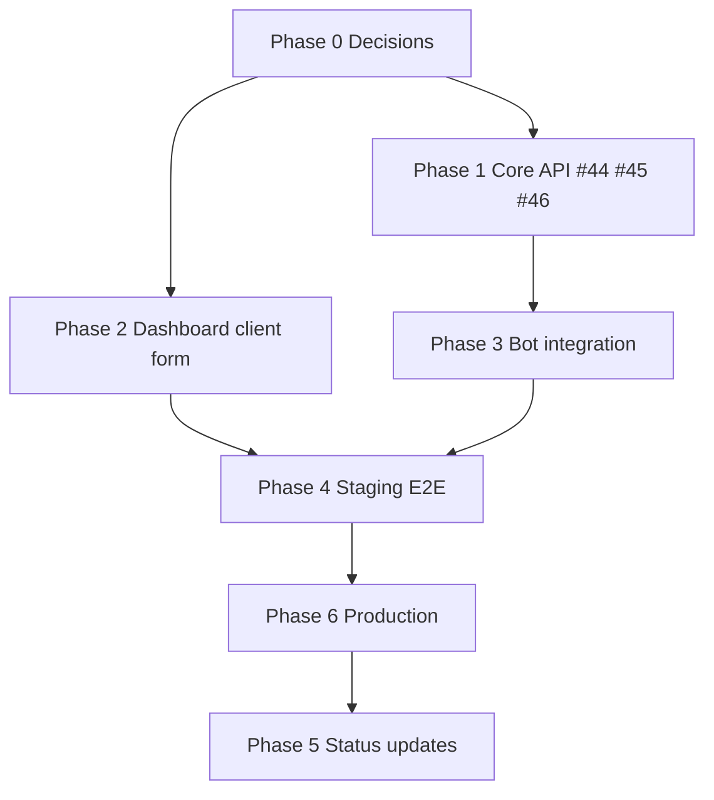

# WhatsApp Service — Phased Rollout Plan

Roadmap to take the LivSight WhatsApp bot from **local DB writes** to **live production** against the core API (`backend_core`).

**Target architecture**

```
WhatsApp group message
        │
        ▼
  wwebjs-bot (this repo)
   · parse message (regex + AI fallback)
   · resolve group → client (core API)
   · POST /api/transactions (core API)
        │
        ▼
  backend_core + dashboard (other repos)
   · client owns packages & transactions
   · admin links group id on client profile
```

**Related GitHub issues (backend_core)**

| Issue | Scope |
|-------|--------|
| [#44](https://github.com/livSight/backend_core/issues/44) | `ROLE_BOT` + JWT; `X-User-Id` only honored for bot |
| [#45](https://github.com/livSight/backend_core/issues/45) | Transaction API: metadata, `delivery_fee`, packages filter, `image` optional, enums |
| [#46](https://github.com/livSight/backend_core/issues/46) | `whatsapp_group_id` on client (optional create, update later) + bot lookup endpoint |

**Canonical `source` values (backend):** `stock` · `pickup` — never `instocke`, `pick_up`, or `in_stock`.

---

## Phase 0 — Prerequisites & decisions ✅ (mostly done)

**Goal:** Lock design before coding.

- [x] Bot submits to core API instead of local `deliveries` table
- [x] Link model: **one WhatsApp group → one client** (`role: client`)
- [x] Store link on **client profile** in core API (`whatsapp_group_id`), not bot DB
- [x] Identifier for transactions: **Keycloak UUID** (`keycloakId`) via `X-User-Id`
- [x] Admin flow: `#link` in group → paste id in dashboard client form
- [x] App-created clients: no group id at first; **update route** when they adopt WhatsApp
- [x] Message parsing: keep simple format; AI fallback fills gaps; admin confirms/enriches in dashboard
- [x] Issues filed for Didier (#44, #45, #46)

### Design decisions log (full record)

| Topic | Decision | Rejected alternative |
|-------|----------|----------------------|
| **Data sink** | Bot calls core API `POST /api/transactions`; no direct writes to local `deliveries` for new orders | Keep writing to bot Postgres only |
| **Auth model** | Bot service account + `ROLE_BOT` JWT + `X-User-Id: <keycloakId>` (#44) | Per-client stored refresh tokens (Option A) |
| **User identifier** | Always **Keycloak UUID** (`keycloakId`) for `X-User-Id`, package filter, and linking — not numeric `user_id` | Numeric `user_id` (fragile across envs/resets) |
| **Link storage** | `whatsapp_group_id` on **client profile** in core API (#46) | Column on bot `groups` table; Groups-page dropdown only |
| **Link cardinality** | **One WhatsApp group = one client** | Shared group with per-sender phone → client mapping |
| **Link UX** | Admin sends `#link` in group → pastes id in dashboard **create or edit client** form | Self-service LINK-code in WhatsApp only |
| **WhatsApp optional** | Clients created from app have **no** group id; **update route** when they adopt WhatsApp later | Group id required at signup |
| **Dashboard location** | Main LivSight dashboard (**separate repo**); not `client/` in this repo unless reused | — |
| **Role name** | End user = **`client`** (not “merchant”) | — |
| **Dashboard picker** | Admin selects client **by name** (dropdown); keycloakId stored internally, never typed | Admin pastes UUID manually |
| **Message strategy** | Two-tier: **strict parser first**, **AI fallback** second (`aiDeliveryExtract`) | Force rigid multi-line template on users |
| **Admin workflow** | Parsed WhatsApp info is **enough to create** the transaction; admin **confirms and adds** extra fields in dashboard (e.g. `cash_collect`, fees) | Relaxed-validation `draft` status on API (deferred) |
| **`amount`** | Cash to collect from receiver when **`cash_collect = true`** | Delivery agency fee (that is `delivery_fee`) |
| **`delivery_fee`** | New field on `TransactionRequest`; **calculation design deferred** | Tariff rules in v1 |
| **`source`** | `stock` (matches client catalog, affects stock) · `pickup` (ad-hoc, **no stock**) | Wrong spellings `instocke`, `pick_up`, `in_stock` — **never use** |
| **`type`** | `delivery` (intracity) · `expedition` (intercity) | Infer only from free-text forever |
| **`pickup`** | Requires departure address fields; does not decrement stock | — |
| **`stock`** | Bot matches `package_name` against `GET /api/packages?userId=<keycloakId>` | Cross-merchant catalog |
| **Catalog cache** | Refresh client packages every **5 minutes** | Fetch on every message |
| **Package matching** | **Exact match first** → **AI closed-set match** before submit; anti-hallucination (name must exist in catalog) | Free-form AI `package_name`; skip matching |
| **Payload format** | `multipart/form-data` to `POST /api/transactions` | JSON body |
| **`image`** | Truly optional at runtime (#45); until fixed, bot may send empty/placeholder part | Require real photo from WhatsApp |
| **Metadata** | `created_via=whatsapp`, `whatsapp_message_id` (idempotent), `raw_input` (#45) | — |
| **Unlinked group** | Friendly auto-reply (“group not linked — contact admin”); **no** transaction | Silent ignore *(still confirm at implementation)* |
| **Status updates** | Reply-based WhatsApp status changes → **Phase 5** (post-MVP) | Block go-live until status sync exists |
| **MVP scope** | Create transactions from WhatsApp; status manual in dashboard until Phase 5 | Full parity with old bot on day one |

**Message format (minimum from user)**

```
612345678
2 robes + 1 sac
15000
Makepe
```

Phone · items · amount (if cash collect) · destination/quartier. AI can infer `source`, `type`, `cash_collect`, etc.

---

## Phase 1 — Core API (backend_core) — **blocking**

**Owner:** Didier (`didiersnake`)  
**Repos:** `livSight/backend_core`  
**Exit criteria:** Bot can authenticate, resolve a group, fetch packages, and create a transaction.

### 1.1 Auth (#44)

- [ ] Bot service account in Keycloak with `ROLE_BOT`
- [ ] `POST /api/transactions` requires JWT
- [ ] `X-User-Id: <keycloakId>` honored only when caller has `ROLE_BOT`
- [ ] Audit log: bot actor + impersonated client

### 1.2 Group → client linking (#46)

- [ ] `whatsapp_group_id` on client user (nullable, unique, `@g.us` validation)
- [ ] Optional on **create**; settable on **update** (clear allowed)
- [ ] `GET /api/users/by-whatsapp-group?whatsappGroupId=...` for bot lookup

### 1.3 Transaction contract (#45)

- [ ] `POST /api/transactions` works **without** `image` part
- [ ] Fields: `created_via`, `whatsapp_message_id`, `raw_input`, `delivery_fee`
- [ ] `whatsapp_message_id` soft-idempotent on POST
- [ ] `GET /api/packages?userId=<keycloakId>` (client catalog only)
- [ ] `GET /api/transactions?created_via=whatsapp` filter for admin review
- [ ] `source` enum documented as: `stock`, `pickup` (backend canonical values)
- [ ] `type` enum: `delivery`, `expedition`
- [ ] OpenAPI updated

### 1.4 Dev credentials for bot team

- [ ] Bot Keycloak username/password (or client credentials)
- [ ] Staging + production base URLs documented
- [ ] One test client with known `keycloakId` for integration tests

---

## Phase 2 — Dashboard (frontend repo)

**Owner:** Frontend team  
**Exit criteria:** Admin can link/unlink WhatsApp groups on client create and edit.

### 2.1 Client create form (“Ajouter un client”)

- [ ] New optional field: **ID groupe WhatsApp**
- [ ] Helper text: *“Envoyez `#link` dans le groupe au bot, puis collez l’ID reçu.”*
- [ ] Submit sends `whatsapp_group_id` only when filled

### 2.2 Client edit form

- [ ] Same field on edit (add / change / clear group id)
- [ ] Show linked status in client list (optional badge: “WhatsApp lié”)

### 2.3 Validation UX

- [ ] Client-side hint if id does not end with `@g.us`
- [ ] Surface API 409 if group already linked to another client

**Note:** Main LivSight dashboard lives in a **separate repo** from this one. The `client/` folder here is the legacy bot dashboard and is not the target for this work unless you explicitly reuse it.

---

## Phase 3 — Bot integration (this repo: `serviceWhatsapp`)

**Owner:** Bot team  
**Exit criteria:** Incoming group messages create transactions on core API end-to-end.

### 3.1 Configuration

Add to `wwebjs-bot/.env`:

```env
CORE_API_BASE_URL=https://...
CORE_AUTH_URL=https://...          # Keycloak / login endpoint
CORE_BOT_USERNAME=...
CORE_BOT_PASSWORD=...
# or CORE_BOT_CLIENT_ID + secret if client-credentials flow
```

- [ ] Extend `wwebjs-bot/src/config.js` with core API settings
- [ ] Document vars in `.envexample`

### 3.2 Core API client module

New module e.g. `wwebjs-bot/src/services/coreApiClient.js`:

- [ ] Login / token refresh (bot JWT)
- [ ] `getClientByWhatsappGroup(groupId)` → keycloakId
- [ ] `getPackages(keycloakId)` with short TTL cache
- [ ] `createTransaction(payload, headers)` multipart form
- [ ] Error mapping (404 unlinked group, 409 duplicate message id, etc.)

### 3.3 Message → TransactionRequest mapping

Build on existing parser + smoke test (`src/scripts/smoke-test-core-transaction.js`):

| Parsed / inferred | Core API field |
|-------------------|----------------|
| phone | `receiver_phone` |
| items | `package_name`, `description` |
| quartier | `destination_street` |
| amount | `amount` (when `cash_collect`) |
| — | `receiver_name` default / AI |
| — | `receiver_gender` default `"Unknown"` (or AI) |
| — | `source`: `stock` \| `pickup` |
| — | `type`: `delivery` \| `expedition` |
| — | `cash_collect`, `serviceLevel` |
| — | `delivery_fee` (when API supports it) |
| raw message | `raw_input` |
| msg id | `whatsapp_message_id` |
| constant | `created_via=whatsapp` |

- [ ] Strict parser first, AI fallback second (existing `aiDeliveryExtract`)
- [ ] **In-stock package matching** — see [§ In-stock package matching](#in-stock-package-matching-before-submit) below
- [ ] Departure fields from client profile or agency defaults

### In-stock package matching (before submit)

When `source = stock`, the bot must send the **exact catalog `package_name`** (same rule as the mobile app dropdown) so stock deduction works. Matching runs **before** `POST /api/transactions`. When `source = pickup`, **skip catalog entirely** — pickup is ad-hoc and never touches stock.

```
WhatsApp message
      ↓
parse (strict → AI fallback for message fields)
      ↓
infer source / type / cash_collect
      ↓
source = pickup?  ──yes──► submit (no catalog)
      │
      no (stock)
      ↓
fetch client catalog  GET /api/packages?userId=<keycloakId>
(cache TTL: 5 minutes)
      ↓
match parsed items → catalog entry (steps below)
      ↓
POST /api/transactions  (exact package_name from catalog when matched)
```

#### Step 1 — Fetch catalog (scoped to client)

- Call `GET /api/packages?userId=<keycloakId>` (#45).
- Cache per client in bot memory/DB with **5-minute TTL** (confirmed).
- Never fetch all merchants' packages.

#### Step 2 — Exact match first (no AI)

Normalize both sides: lowercase, trim, strip diacritics, simple plural handling.

| Result | Action |
|--------|--------|
| Parsed `items` matches **one** catalog `package_name` (case-insensitive) | Use that **verbatim** catalog name in `package_name`; set `quantity` from parser if present |
| 0 packages in catalog | Skip AI; submit raw text; admin picks from catalog in dashboard |
| 1 package only | Auto-select that package (trivial case; skip AI) |

#### Step 3 — AI match (closed-set, only if exact match failed)

Send to AI (e.g. `gpt-4o-mini`):

- Parsed item text from the message (e.g. `"2 robes + 1 sac"`)
- Client's catalog as a **closed list** of allowed `package_name` values (+ optional sku/aliases if API exposes them)

AI returns JSON only, e.g.:

```json
{ "matched_package_name": "Robe wax", "quantity": 2, "confidence": 0.92 }
```

or `null` if no good match.

**Anti-hallucination (mandatory):**

- `matched_package_name` must be **exact equality** against a catalog entry after normalization — reject anything else.
- If AI returns a name not in the catalog → discard, treat as no match.
- AI selects from a **closed set**, never invents new product names.
- Log every AI match for audit during pilot.

**Cost discipline:**

- Skip AI if exact match succeeded.
- Skip AI if catalog has 0 or 1 items (handled in Step 2).
- Respect existing `AI_DELIVERY_FALLBACK_*` budget caps.

#### Step 4 — Decide from confidence

| Confidence | Action |
|------------|--------|
| **≥ 0.85** | Submit with matched catalog `package_name` + parsed `quantity` |
| **0.60 – 0.84** | Submit with matched name; flag for admin review in dashboard if/when API supports a review flag — otherwise admin uses `raw_input` + catalog list |
| **< 0.60 or no match** | Submit with **raw parsed text** as `package_name`; admin corrects in dashboard before/at delivery |

*(We are not using API `draft` status — transaction is created; admin fixes wrong package names in dashboard.)*

#### Step 5 — Quantity

- Parser / AI should resolve **both** `matched_package_name` and `quantity` together.
- Example: `"3 robes"` → catalog entry `Robe wax`, `quantity = 3`.
- Do not match a bundle SKU (e.g. `"pack 3 robes"`) unless the catalog entry is literally that bundle name.

#### Step 6 — Submit payload

- `source = stock`
- `package_name` = matched catalog name (preferred) or raw parsed text (fallback)
- `quantity` = from parser/AI when known
- `description` = full parsed items line (unchanged)
- `cash_collect` + `amount` from parser/AI inference (admin can fix in dashboard)

#### E2E tests for matching

- [ ] Exact match: `"2 robes"` → catalog `"Robe wax"` when normalized match exists
- [ ] AI match: typo / synonym (`"robe waks"`) → correct catalog entry, confidence ≥ 0.85
- [ ] AI hallucination: model returns unknown name → rejected, raw text submitted
- [ ] Multi-item line: quantity split or best-effort (document limitation if v1 matches primary item only)
- [ ] `pickup` message → catalog fetch **not** called
- [ ] Catalog cache: second message within 5 min does not refetch packages


### 3.4 Replace local DB submission

Today: `deliveryHandler` → `deliveries` table in bot Postgres.

- [ ] Route new orders through `coreApiClient.createTransaction`
- [ ] Resolve client: `getClientByWhatsappGroup(whatsappGroupId)` before submit
- [ ] Set headers: `Authorization: Bearer <bot_jwt>`, `X-User-Id: <client keycloakId>`
- [ ] Decide fate of local `deliveries` table: archive only, or mirror for bot-side reply/status (Phase 5)

### 3.5 `#link` command polish

Already implemented in `messageHandler.js`:

- [ ] Reply includes group id **and** short instruction to paste in dashboard
- [ ] Optional: restrict `#link` to group admins (future)

### 3.6 Unlinked / unknown groups

- [ ] If group not in core API → friendly auto-reply: group not linked, contact admin
- [ ] Do not create local delivery rows for unlinked groups

### 3.7 Bot confirmation message

- [ ] After successful POST, reply in WhatsApp with reference / summary (reuse existing reply patterns)
- [ ] On validation error, reply with what’s missing (keep messages short)

---

## Phase 4 — Testing & staging

**Exit criteria:** Repeatable E2E on staging before production traffic.

### 4.1 Automated / script tests

- [ ] Extend `smoke-test-core-transaction.js` to call live API (not just print curl)
- [ ] Integration test: parse sample messages → expected payload shape
- [ ] Test idempotency: same `whatsapp_message_id` twice → one transaction

### 4.2 Manual E2E checklist

1. [ ] Create client in dashboard **without** group id → app works as today
2. [ ] Add bot to WhatsApp group → `#link` → copy id
3. [ ] Edit client → paste group id → save
4. [ ] Send sample order message → transaction appears in core dashboard for that client
5. [ ] Send same message again (or retry) → no duplicate (idempotency)
6. [ ] Unlinked group message → bot auto-reply, no transaction
7. [ ] `stock` order with matching package name → correct package linkage
8. [ ] `pickup` order → no stock decrement

### 4.3 Staging environment

- [ ] Bot pointed at staging core API
- [ ] Dedicated WhatsApp session (`CLIENT_ID`) for staging
- [ ] One pilot client group only (`GROUP_ID` filter optional during pilot)

---

## Phase 5 — Status updates & replies (post-MVP)

**Goal:** Drivers/agents update delivery status from WhatsApp replies (existing bot behavior).

Current bot uses local `deliveries.whatsapp_message_id` for reply-based updates.

- [ ] Define core API endpoint for status updates from bot (`PUT` transaction status?)
- [ ] Map `statusParser` keywords → core statuses
- [ ] Store core `transaction_id` locally or resolve by `whatsapp_message_id` via core API
- [ ] Issue on backend_core if endpoint does not exist

*Can launch Phase 3–4 without this if MVP is create-only; status updates stay manual in dashboard until Phase 5.*

---

## Phase 6 — Production go-live

**Exit criteria:** Bot running 24/7, monitored, with at least one real client group.

### 6.1 Infrastructure

- [ ] Deploy bot process (PM2 / Docker / Render — see `PRODUCTION_DEPLOYMENT_CHECKLIST.md`)
- [ ] Persistent WhatsApp session volume (`CLIENT_ID`, LocalAuth)
- [ ] Production env vars (core API URL, bot credentials, `NODE_ENV=production`)
- [ ] Remove or relax `GROUP_ID` single-group filter for multi-client rollout

### 6.2 Security

- [ ] Bot credentials in secrets manager, not committed
- [ ] Core API: confirm `X-User-Id` cannot be used without `ROLE_BOT` (#44)
- [ ] Rate limiting / alerting on bot auth failures

### 6.3 Operations

- [ ] Health check: bot connected to WhatsApp + can reach core API
- [ ] Log aggregation for failed submissions
- [ ] Runbook: re-link QR session, rotate bot password, unlink wrong group

### 6.4 Pilot → rollout

1. [ ] **Pilot:** 1 client, 1 group, 1 week monitored
2. [ ] Fix parsing edge cases from real messages
3. [ ] **Rollout:** onboard clients via dashboard (edit → paste group id)
4. [ ] Announce `#link` procedure to agency admins

---

## Dependency graph



**Critical path to first live transaction:** Phase 1 → Phase 3 → Phase 4 → Phase 6.  
Phase 2 can run in parallel with Phase 3 once #46 is merged (bot can use API directly for testing before dashboard UI ships).

---

## What we are *not* doing in v1

- Fee calculation design (`delivery_fee` field exists; `source` / `serviceLevel` rules come later)
- Draft transaction workflow with relaxed API validation (admin enriches in dashboard UI instead)
- Per-message client detection in shared groups (one group = one client)
- Storing client refresh tokens per group (bot service account only)
- Link column on bot `groups` table (link lives on core API client profile)
- Mandatory WhatsApp group id at client signup

---

## Quick reference — admin onboarding (go-live)

1. Create client in dashboard (no WhatsApp field required).
2. Add LivSight bot to the client’s WhatsApp group.
3. Send `#link` → copy `120363…@g.us`.
4. Edit client → paste **ID groupe WhatsApp** → save.
5. Client sends orders in normal short format → bot creates transactions on their account.

---

*Last updated: May 2026 — align with backend_core issues #44, #45, #46.*
